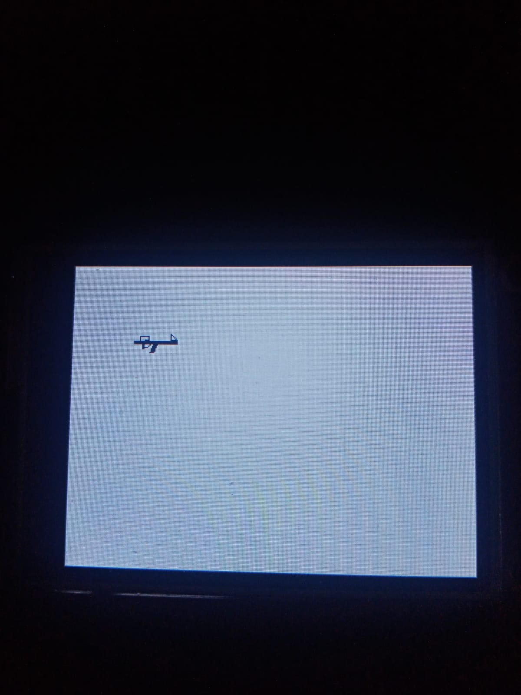

# STM32 & Nextion 



## 🚀 Purpose and Architectural Approach

Nextion screens have limited built-in drawing capabilities. This library leverages the flexibility of C to construct complex shapes (e.g., a stickman or a fully equipped weapon) by chaining together basic geometric primitives (`Line`, `Circle`, `Triangle`).


### 💡 Highlight Feature: Relative Drawing (Offset) Logic

To draw a complete gun with a barrel, iron sights, and a magazine, we had to use 13 different lines, a circle, and a triangle. 

**❌ The Old (Messy & Static) Method:**
Initially, every single line was defined in the global scope with absolute (static) coordinates. Moving the gun to the right meant manually adding `+5` to the X and Y values of 15 different discrete objects.

**✅ The New (Modular & Dynamic) Method:**
We encapsulated all this complexity into a single `draw_gun` function. Instead of hardcoded absolute numbers, we established a **Single Reference Point (X, Y)**. We also achieved "thickness" by drawing adjacent lines. Every part of the gun is mathematically calculated and drawn based on its offset relative to this center coordinate.

```c
// CLEAN CODE: A single composite object (Prefab) bound to a reference point.
// All components are shifted relative to the input (x, y) coordinates.
void draw_gun(uint16_t x, uint16_t y, uint16_t color) {
    
    // Barrel (Adding +1 to Y to create thickness)
    Line line1= {x, y,   x+35, y, color};
    Line line2= {x, y+1, x+35, y+1, color};
    Line line3= {x, y+2, x+35, y+2, color};
    Line line4= {x, y+3, x+35, y+3, color};
    draw_line(&line1);
    draw_line(&line2);
    draw_line(&line3);
    draw_line(&line4);
    
    // Iron Sight
    Line line5= {x+5, y-3, x+5, y, color};
    Line line6= {x+5, y-3, x+12, y-3, color};
    Line line7= {x+12, y-3, x+12, y, color};
    draw_line(&line5);
    draw_line(&line6);
    draw_line(&line7);

    // Grip
    Line line8= {x+7, y+3, x+7, y+7, color};
    Line line9= {x+8, y+3, x+8, y+7, color};
    draw_line(&line8);
    draw_line(&line9);

    // Magazine (Angled by manipulating X and Y offsets)
    Line line10= {x+16, y+3, x+13, y+10, color};
    Line line11= {x+17, y+3, x+14, y+10, color};
    Line line12= {x+18, y+3, x+15, y+10, color};
    Line line13= {x+19, y+3, x+16, y+10, color};
    draw_line(&line10);
    draw_line(&line11);
    draw_line(&line12);
    draw_line(&line13);

    // Trigger/Details
    Circle circle1 = {x+10, y+3, 3, color};
    draw_circle(&circle1);
    
    // Front Sight / Flash (Triangle)
    // Note on Coordinate System: To calculate this, determine a center point.
    // E.g., if the center is 100,100, subtracting 20 from Y means going UP.
    // Subtracting 15 from X means moving LEFT because the screen's (0,0) is at the top-left.
    Triangle triangle1={x+30, y-5, x+30, y, x+35, y, color};
    draw_triangle(&triangle1);
}
```
🛠️ Key Benefits
Effortless Animation: Moving the entire complex object on the screen simply requires changing the x and y parameters passed to the function.

RAM Optimization: Instead of global variables permanently occupying RAM, local variables are dynamically allocated on the Stack only when the function is called.

Clean Code (DRY): Dramatically reduced lines of code, creating a modular structure.

🎮 How to Use
To animate an object in your main game loop (while(1)), simply follow the standard 3-step rendering pipeline: Erase Old -> Update Position -> Draw New.
```c
int gun_x = 140;
int gun_y = 120;

while(1) {
    // 1. Erase the old frame (Draw with background color)
    draw_gun(gun_x, gun_y, COLOR_WHITE);
    
    // 2. Update coordinates
    gun_x += 5; 
    
    // 3. Draw the new frame (Draw with object color)
    draw_gun(gun_x, gun_y, COLOR_BLACK);
    
    HAL_Delay(50); // Frame rate control (FPS)
}
```
