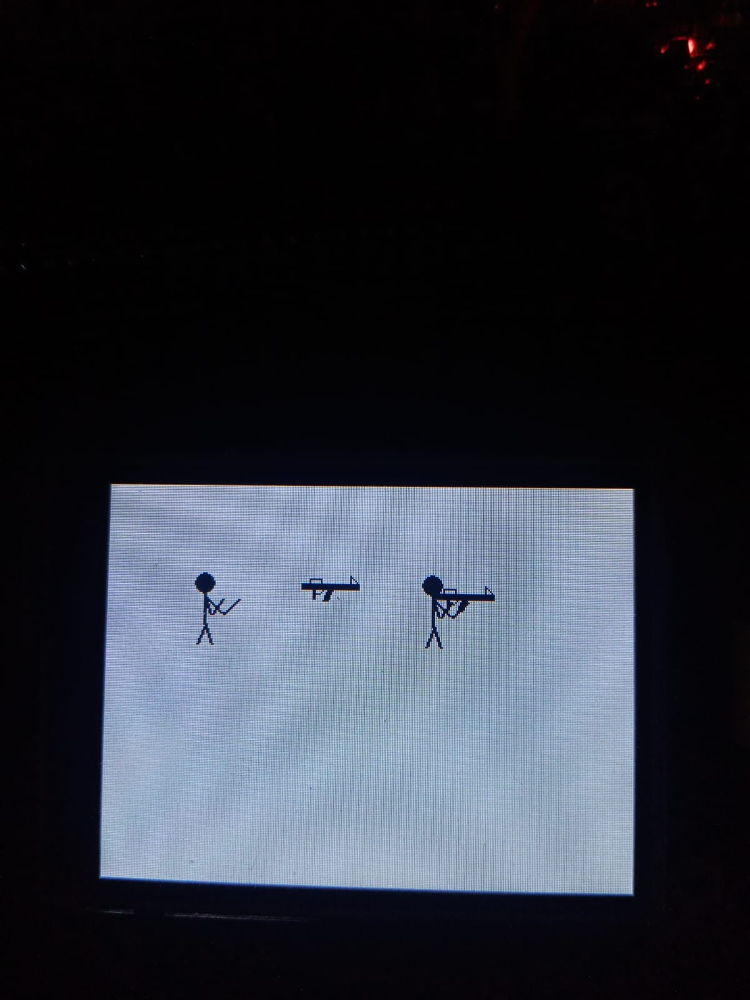

# STM32 & Nextion 2D Graphics Library: Character Composition




This project demonstrates  2D rendering techniques on a Nextion TFT display using an STM32 microcontroller. Building upon basic geometric shapes (lines, circles, triangles), this project introduces **Relative Rendering (Offsets)** and **Object Composition** to create a fully armed, dynamic character.

## 📁 Custom Graphics Library (`gf_library`)

To keep the `main.c` file clean, we abstracted all the hardware-level UART communication and drawing mathematics into a custom C library.

* **`gf_library.h`**: Contains the data structures (`Line`, `Circle`, `Triangle`) holding the `(x, y)` coordinates and color data.
* **`gf_library.c`**: Handles the string formatting (`sprintf`) and direct hardware transmission (`HAL_UART_Transmit`) to the Nextion display. 

## 🚀 Core Concept: Relative Drawing 

Redrawing complex shapes pixel-by-pixel with static coordinates is inefficient. To solve this, we designed our objects (a Stickman and a Gun) bound to a single **Anchor Point (X, Y)**.

Every limb of the stickman and every part of the gun is calculated mathematically relative to this center point. For example, the Stickman uses its head as the `(X, Y)` anchor, and the rest of the body is drawn by adding offsets (e.g., `y+6`, `x+12`) to this origin.

## 🧬 Object Composition

```c
// military armed drawing method
void draw_gunner(uint16_t x, uint16_t y, uint16_t color){
    // Shift the gun's anchor point to match the character's hands
    draw_gun(x+2, y+5, color);
    
    // Draw the character (Anchor point: Head at x, y)
    draw_stickman(x, y, color);
}
```
🏃 How to Animate
In your main while(1) loop, simply use the standard rendering pipeline (Clear -> Move -> Draw):
```c
int soldier_x = 50;
int soldier_y = 60;

while(1) {
    // 1. Erase the old frame
    draw_gunner(soldier_x, soldier_y, COLOR_WHITE);
    
    // 2. Move the entire character
    soldier_x += 5; 
    
    // 3. Draw the new frame
    draw_gunner(soldier_x, soldier_y, COLOR_BLACK);
    
    HAL_Delay(100); // Frame delay
}
```