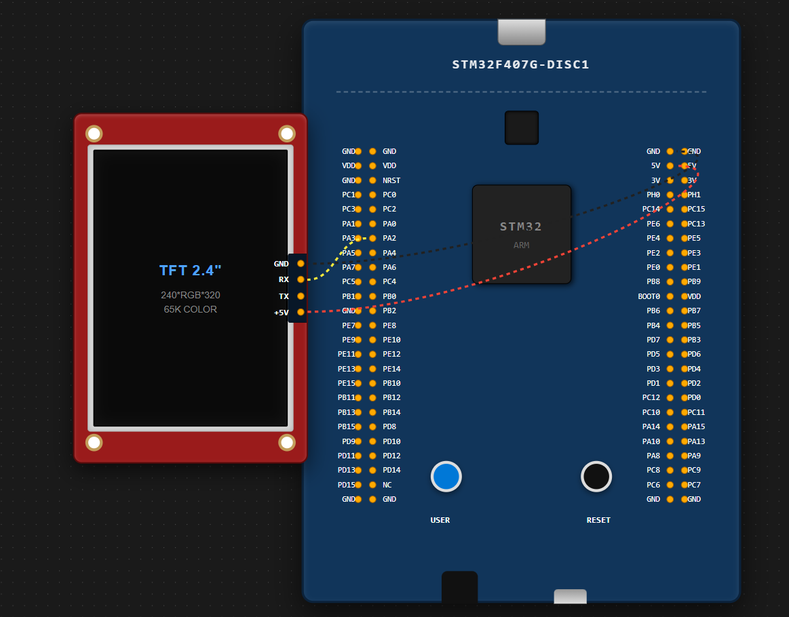
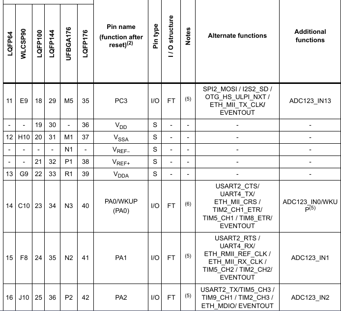
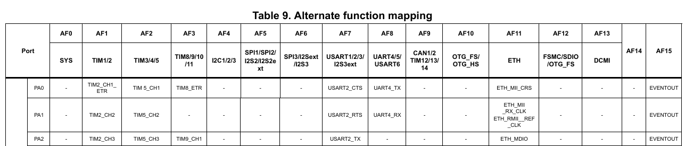
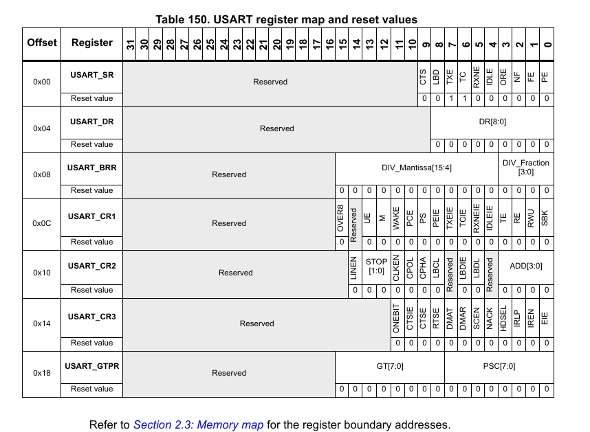
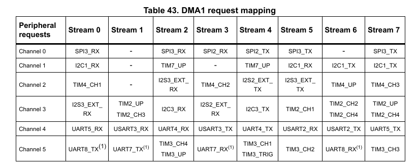

# STM32F407 DMA-UART Communication (Manual Configuration)

This repository contains a specialized implementation of **DMA (Direct Memory Access)** based communication between an **STM32F407G-DISC1** and a **Nextion TFT Display**. 

The core philosophy of this project is to move away from fully automated code generation and instead configure the hardware registers manually by studying the official technical documentation.

## 🚀 Key Features

* **Bare-Metal Style Configuration:** GPIO, Clock (RCC), and UART settings were configured manually using the HAL library but driven by register-level logic.
* **DMA1 Stream 6 / Channel 4:** Leveraged the specific hardware mapping of the STM32F407 architecture to offload USART2_TX tasks.
* **Nextion Protocol Integration:** Seamlessly handled the mandatory `0xFF 0xFF 0xFF` termination packets required by the Nextion instruction set using DMA bursts.
* **Hardware Validation:** Used the on-board **LD4 (Green LED)** as a physical success signal once the DMA transfer was verified.

## 📚 Technical Documentation Used

No "black box" tools were used for the logic. The implementation is based strictly on:
1.  **RM0090 Reference Manual:** Used for DMA Stream/Channel mapping and UART control register definitions.
2.  **STM32F407VGT6 Datasheet:** Used for mapping Pin PA2 to its "Alternate Function 7 (AF7)" mode.

## 🛠 Hardware Setup

| STM32F407 Pin | Nextion Pin | Function |
| :--- | :--- | :--- |
| **PA2 (TX2)** | **RX** | UART Data Transmission |
| **5V** | **5V** | Power Supply |
| **GND** | **GND** | Common Ground |

> **Note:** A cross-connection (TX to RX) is utilized for the UART communication line.

## 💡 Engineering Insight: Polling vs. Interrupt

In this initial release, **Polling Mode** (`HAL_DMA_PollForTransfer`) is used to verify the successful completion of the transfer. While this method effectively validates the hardware configuration, it briefly blocks the CPU. 

**Next Milestone:** Transition to **Interrupt Mode (IT)** to fully decouple the CPU from the transmission process, allowing it to perform high-speed calculations (like joystick input or game logic) while the DMA handles the data in the background.

## 📂 Project Structure

* `main.c`: Contains the main application loop and the logic for sequential DMA bursts.
* `Custom_GPIO_Clock_Init()`: Manual setup for peripheral clocks and Pin AF configurations.
* `Custom_UART_DMA_Init()`: Detailed configuration for DMA Streams and Channels based on Table 43 of RM0090.

---
*Developed as part of a personal project exploring high-speed embedded communication.*

