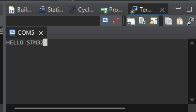

# STM32F407 Manual UART DMA Interrupt

This project demonstrates how to perform **UART Transmission using DMA** on the **STM32F407 Discovery** board. It focuses on **manual DMA configuration** to understand hardware-level registers and interrupt handling.

## 🛠 Hardware Configuration
* **MCU:** STM32F407VGT6
* **UART:** USART2 (Baud Rate: 115200)
* **DMA:** DMA1, Stream 6, Channel 4 (Fixed to USART2_TX)

## 🔌 Connection
* **STM32 PA2 (TX)** ➡️ **USB-TTL RX**
* **STM32 GND** ➡️ **USB-TTL GND**

## 📂 Required Code Additions

### 1. In `stm32f4xx_it.c`
To handle the DMA transfer completion, you must add the following to your interrupt file:

```c
/* External variables */
extern DMA_HandleTypeDef hdma_usart2_tx;

/* DMA1 Stream 6 Interrupt Handler */
void DMA1_Stream6_IRQHandler(void)
{
  HAL_DMA_IRQHandler(&hdma_usart2_tx);
}
```
2. In main.c (Manual Setup Highlights)
The DMA is initialized manually with these critical settings:

MemInc (Enabled): Increments memory address to move through the string.

PeriphInc (Disabled): Keeps the UART Data Register address fixed.

XferCpltCallback: Linked to DMATransferComplate to trigger the Orange LED (LD3) upon finish.

🚀 Execution Logic
The DMA is configured and started in Interrupt Mode via HAL_DMA_Start_IT.

The UART's DMAT bit is set (USART_CR3_DMAT |= 1) to request data from the DMA.

The CPU remains free while the DMA sends the message "HELLO STM32".

Once finished, the interrupt fires, calling the Handler in it.c, which then triggers the user callback to light up the LED.
