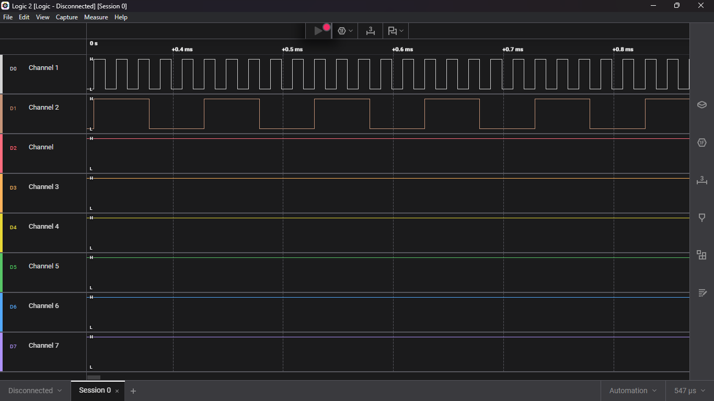

# STM32 Dual-Frequency Generation via Timer Output Compare

This project demonstrates how to generate two independent square wave signals with different frequencies using a single hardware timer (**TIM3**) on the **STM32F407VGT6** microcontroller. By utilizing the **Output Compare (OC) Toggle** mode with interrupts, we achieve high-precision timing with minimal CPU overhead.

## 🚀 Project Overview

The goal is to generate:
- **Channel 1 (PC6):** 50 kHz Square Wave
- **Channel 2 (PB5):** 10 kHz Square Wave

Unlike standard PWM, where all channels must share the same frequency (ARR period), the **Output Compare Toggle** method allows each channel to have its own independent "next-event" calculation in the interrupt callback, enabling different frequencies on the same timer.

## 📊 Results (Logic Analyzer)

Below is the output captured from the logic analyzer showing the synchronized independent signals:




## 🛠 Hardware Configuration (STM32CubeMX)

### Clock Settings
- **HSE:** Crystal/Ceramic Resonator
- **HCLK:** 168 MHz
- **APB1 Timer Clock:** 84 MHz

### TIM3 Configuration
- **Clock Source:** Internal Clock
- **Channel 1:** Output Compare CH1 (Routed to **PC6**)
- **Channel 2:** Output Compare CH2 (Routed to **PB5**)
- **Prescaler (PSC):** 83 (Resulting in 1 MHz Timer Frequency / 1µs ticks)
- **Counter Period (ARR):** 65535
- **Mode:** Toggle on match
- **NVIC:** TIM3 global interrupt enabled

## 💻 Mathematical Calculation

The Pulse Increment (how many ticks to wait for the next toggle) is calculated as:
$$\text{Pulse Increment} = \frac{\text{Timer Clock (1 MHz)}}{2 \times \text{Target Frequency}}$$

- **For 50 kHz:** $1,000,000 / (2 \times 50,000) = 10$ ticks
- **For 10 kHz:** $1,000,000 / (2 \times 10,000) = 50$ ticks

## 📝 Implementation Snippet

The core logic resides in the `HAL_TIM_OC_DelayElapsedCallback`:

```c
void HAL_TIM_OC_DelayElapsedCallback(TIM_HandleTypeDef *htim) {
    uint32_t pulse;
    uint16_t arr = __HAL_TIM_GET_AUTORELOAD(htim);

    if (htim->Instance == TIM3) {
        // Channel 1 - 50kHz (PC6)
        if (htim->Channel == HAL_TIM_ACTIVE_CHANNEL_1) {
            pulse = HAL_TIM_ReadCapturedValue(htim, TIM_CHANNEL_1);
            __HAL_TIM_SET_COMPARE(htim, TIM_CHANNEL_1, (pulse + 10) % arr);
        }
        // Channel 2 - 10kHz (PB5)
        if (htim->Channel == HAL_TIM_ACTIVE_CHANNEL_2) {
            pulse = HAL_TIM_ReadCapturedValue(htim, TIM_CHANNEL_2);
            __HAL_TIM_SET_COMPARE(htim, TIM_CHANNEL_2, (pulse + 50) % arr);
        }
    }
}
```