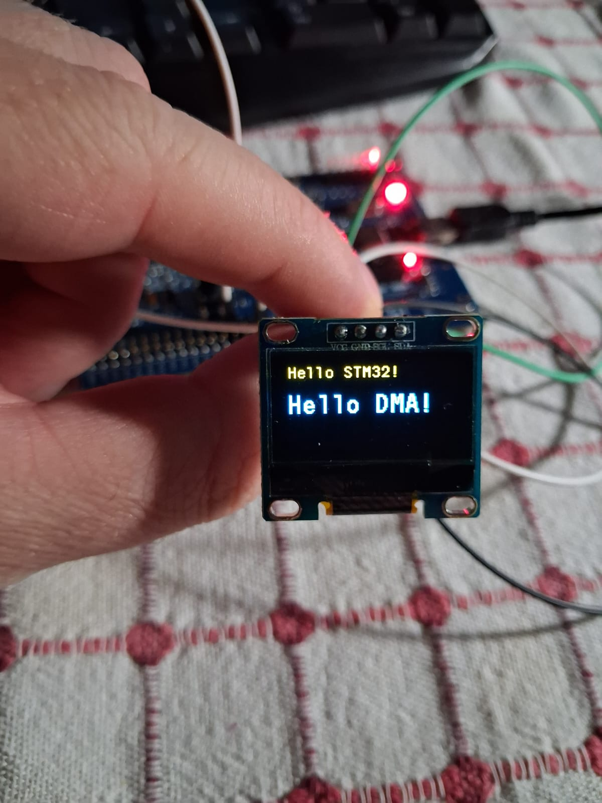

# STM32 SSD1306 OLED Display with I2C & DMA 🚀

A high-performance, non-blocking implementation for driving an SSD1306 OLED display (128x64) using an STM32 microcontroller. By leveraging **I2C Fast Mode (400 kHz)** and **DMA (Direct Memory Access)**, this project ensures that screen updates take **0 CPU cycles** after the initial trigger, leaving the processor completely free for other critical tasks like reading sensors or running control algorithms.

<div align="center">
  <table>
    <tr>
      <td width="50%">
        
      </td>
      <td width="50%">
        <h3>⚡ Why DMA? (The Advantage)</h3>
        <p>Sending a 1024-byte framebuffer over I2C using standard polling (blocking) mode takes around <b>20-25 milliseconds</b>. During this time, the CPU is essentially blind and cannot perform other tasks.</p>
        <p>By using <code>HAL_I2C_Mem_Write_DMA()</code>, we offload the entire transmission to the hardware DMA controller. The CPU triggers the transfer in just <b>1 microsecond</b> and immediately moves on to the next line of code.</p>
      </td>
    </tr>
  </table>
</div>

## 📌 Features

- **Asynchronous Updates:** Zero CPU blocking time during screen refreshes.
- **Fast Mode I2C:** Configured for 400 kHz transmission.
- **Rich Graphics Library:** Based on the popular [afiskon/stm32-ssd1306](https://github.com/afiskon/stm32-ssd1306) library.
- **Geometric Drawings:** Supports drawing lines, rectangles, circles, and custom bitmaps.
- **Multiple Fonts:** Includes various font sizes (e.g., 6x8, 7x10, 11x18).

## 🛠️ Hardware Setup

This project uses a standard 4-pin I2C OLED display (0.96" or 1.3").

| OLED Pin | STM32 Pin | Description |
| :--- | :--- | :--- |
| **VCC** | `3.3V` | 3.3V Power Supply |
| **GND** | `GND` | Ground |
| **SCL** | `PB6` | I2C Clock (Check your CubeMX Pinout) |
| **SDA** | `PB9` | I2C Data (Check your CubeMX Pinout) |

## ⚙️ STM32CubeMX Configuration

To run this project, make sure your `.ioc` file is configured as follows:

1. **I2C Settings:** - Speed Mode: `Fast Mode`
   - Clock Speed: `400000 Hz`
2. **DMA Settings:** - Add `I2C1_TX`
   - Direction: `Memory To Peripheral`
   - Increment Address: Memory (`Checked`), Peripheral (`Unchecked`)
3. **NVIC Settings:**
   - Enable `I2C1 event interrupt` & `I2C1 error interrupt`
   - Enable `DMA stream global interrupt`

> **⚠️ CRITICAL:** In your `main.c`, ensure that `MX_DMA_Init();` is called **BEFORE** `MX_I2C1_Init();`. Otherwise, the system will hard fault.

## 💻 Usage Example

```c
#include "ssd1306.h"
#include "ssd1306_fonts.h"
  /* USER CODE BEGIN 2 */
  ssd1306_Init();
  ssd1306_SetCursor(1, 2);
  ssd1306_WriteString("Hello STM32!", Font_7x10, White);
  ssd1306_SetCursor(1, 20);
  ssd1306_WriteString("Hello DMA!", Font_11x18, White);
  ssd1306_UpdateScreen_DMA();
  /* USER CODE END 2 */

  /* Infinite loop */
  /* USER CODE BEGIN WHILE */
  while (1)
  {
    /* USER CODE END WHILE */
    MX_USB_HOST_Process();

    /* USER CODE BEGIN 3 */
  }
  /* USER CODE END 3 */
```
```c
/* Write the screenbuffer to the screen using DMA */
void ssd1306_UpdateScreen_DMA(void) {
    // 1. Check if previous DMA transfer has finished
    // We wait until the I2C bus is ready (not busy)
    while (HAL_I2C_GetState(&SSD1306_I2C_PORT) != HAL_I2C_STATE_READY) {
        // You can optionally add a small delay here if using an RTOS (e.g., osDelay(1);)
        // to yield to other tasks instead of blocking completely.
    }

    // 2. Send the entire screen buffer in one go using DMA.
    // 0x40 tells the OLED "The following bytes are pixel data, not commands".
    // We send 1 byte of 0x40, followed by the 1024 bytes (for 128x64) of SSD1306_Buffer.
    HAL_I2C_Mem_Write_DMA(&SSD1306_I2C_PORT, SSD1306_I2C_ADDR, 0x40, 1, SSD1306_Buffer, sizeof(SSD1306_Buffer));
}
```